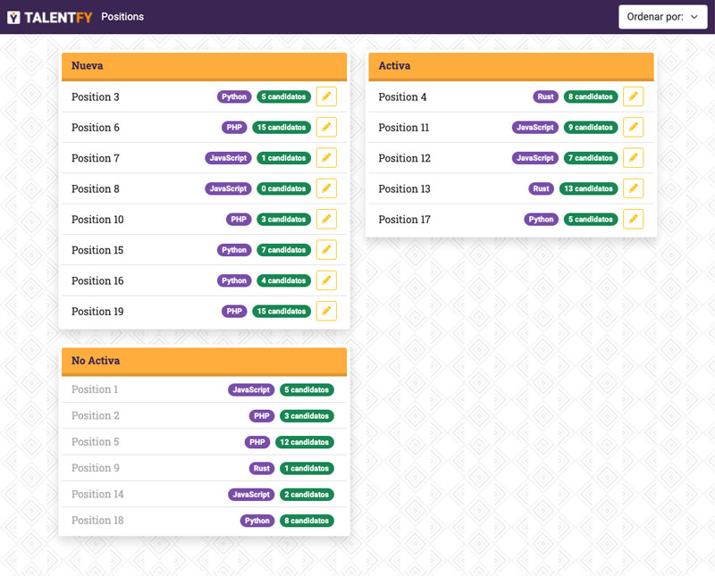

# TalentFY Positions

Prueba técnica de Front-End Developer en Angular para **TalentFY**.



# Instrucciones
Clonar el repositorio localmente:

```bash
git clone https://github.com/xavieraijon/talentfy-candidates.git
```

Acceder al directorio del proyecto:

```bash
cd talentfy-candidates
```


Instalar todas las dependencias del proyecto:

```bash
npm install
```
> Esto creará el directorio `node_modules`

## **¡ATENCIÓN!** 
Para un manejo más realista de una **API REST** se ha usado [JSON Server](https://github.com/typicode/json-server).

***Es necesario instalar JSON Server para el correcto funcionamiento de la aplicación.***

## Instalación y puesta en marcha de **JSON Server**

**Instalación**


```bash
npm install -g json-server
```

**Puesta en marcha**

Una vez instalado, si no lo estamos, accedemos al directorio del proyecto y arrancamos **JSON Server** de la siguiente forma:

```bash
json-server --watch src/assets/data/db.json
```
> En la carpeta `assets/data` del repositorio ya existe el archivo `db.json`, que es una copia del `positions.json` con el mismo formato.

Esto creará un servicio **API REST** basado en el archivo `db.json` simulando un backend.

Una vez arrancado **JSON Server**, ya podemos proceder a arrancar el servidor de desarrollo **Angular** normalmente:

```bash
ng serve
```
> **IMPORTANTE:** Hay que iniciar Angular en un terminal nuevo, ya que deben correr ambos servicios a la vez.

Para cualquier duda os podéis poner en contacto [conmigo](mailto:xavi.aijon@gmail.com).


Gracias!

Xavi
